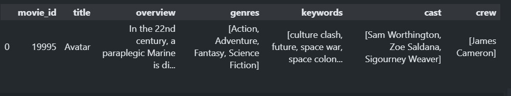
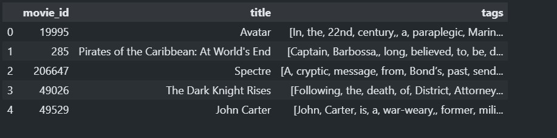

<h1 align="center"> <a href="https://github.com/anugoyal998/MeChat"><strong> 🎥 Movie Recommendation System 🎥</strong></a></h1>

        

**Movie Recommendation System**, recommends similar movies corresponding to movie user gives. Made using **Streamlit**, deployed to **Heroku**.

Website Link: [Movie Recommendation System](https://movie-recommendation-system-py.herokuapp.com)  
Youtube Link: [Movie Recommendation System](https://youtu.be/X1RrRuSYh8I)

#### Dataset Used
[tmdb_5000_credits.csv](https://www.kaggle.com/datasets/tmdb/tmdb-movie-metadata?select=tmdb_5000_movies.csv)
[tmdb_5000_movies.csv](https://www.kaggle.com/datasets/tmdb/tmdb-movie-metadata?select=tmdb_5000_movies.csv)

It's a TMDB (The Movies DataBase) dataset of 5000 movies.

## Model Building
Out of the above dataset, I use these columns of the dataset  

 
Then, created a **tags** field using **overview, genres, keywords, cast, and crew**. And, the final Dataset looks like this  

To recommend similar movies, I calculated **similarity score** of movies and show the user top 5 similar movies. Similarity score is calculated using **Vectorization** process, by finding **cosine distance** between two vectors.

## Preview
<iframe width="560" height="315" src="https://www.youtube.com/embed/X1RrRuSYh8I" title="YouTube video player" frameborder="0" allow="accelerometer; autoplay; clipboard-write; encrypted-media; gyroscope; picture-in-picture" allowfullscreen></iframe>

